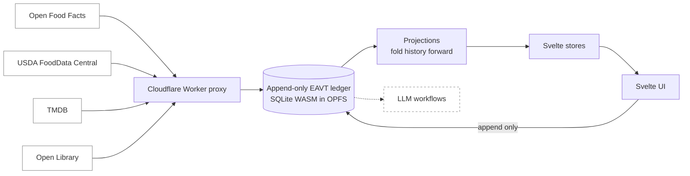

# Inventoria

One local-first ledger for everything you track, owned outright by the person
running it.

## Why it exists

Every habit, every meal, every film watched ends up locked inside a different app,
each behind its own account and its own server, none of them willing to talk to the
others. Inventoria was built to end that: a single local-first ledger that records
physical items and daily behaviours in one place and answers to no cloud. The whole
picture lives in one file on one device, and the person running it decides what it
does next.

So the project is shaped as a **substrate, not an app**. Nothing is ever overwritten.
Every fact is a timestamped row in an append-only ledger, and the present is only a
reading of the past. That shape is deliberate: new capabilities can be added without
migrating a schema, and the whole history stays legible to the LLM-driven workflows
intended to run over it later.

Concretely, Inventoria is a Progressive Web App built with Svelte and strict
TypeScript. It keeps a SQLite database inside the browser, in a background Web Worker
over the Origin Private File System, and stores one immutable table of
Entity-Attribute-Value-Time facts called **datoms**. Every view the interface shows is
computed by folding that history forward into current state. What you get is an
offline, installable tracker for food, media, physical goods, habits, and calendar
events, all sharing the same store.

## How it fits together



_Everything flows through one store: outside sources seed twins through a thin proxy,
writes only append, and every reader folds the same history forward. The dashed path
is the intended future._

External data enters through that thin proxy and nowhere else. Open Food Facts, USDA
FoodData Central, TMDB, and Open Library supply the facts that seed a **Digital
Twin**, and a small Cloudflare Worker relays the requests so the browser can sidestep
cross-origin limits.

From there the rule is absolute: writes only append. When the worker commits a new
datom it broadcasts a signal, and every Svelte store watching a folded view re-runs
its query. The dashed path is the intended future, not something that exists yet.

## The mental model

Four terms carry most of the weight. The full vocabulary is in
[CONTEXT.md](CONTEXT.md).

- A **datom** is one immutable fact: an entity, an attribute, a value, and a clock
  stamp. `gtin:3017620422003` / `food/name` / `Nutella` / a timestamp.
- The **ledger** is the single `datoms` table those rows live in. It only ever grows.
  There are no `UPDATE` or `DELETE` statements anywhere in the write path.
- A **projection** is a pure fold over an entity's datoms that lets the latest value
  for each attribute win. Current state is never stored; it is what falls out of the
  fold.
- A **Digital Twin** is the entity an outside source seeds: a food, a film, a
  kettlebell. Events then reference it.

Two structural rules follow from this and are worth knowing before you read any code.
**SQLite runs only inside the Web Worker**; the main thread never touches it, and
talks to it over async RPC. And **anything the ledger touches is snake_case**, so it
is `meal_type` all the way from the attribute key to the Svelte store property.

Why the database works this way, and what it costs, is argued in
[State Is a Reading of the Past](docs/append-only-ledger.md).

## The shape of the code

```
src/
├── App.svelte, main.ts, app.css     the shell and the design tokens
└── lib/
    ├── db/          the ledger: db.core.ts (schema, append, migrations),
    │                db.worker.ts (thin RPC orchestration), projections.ts, hlc.ts
    ├── stores/      Svelte stores; reactivity only, no domain logic
    ├── views/       screens and their sub-components (food, habits, items,
    │                media, notes)
    ├── ui/          shared primitives: BottomSheet, Modal, Button, Card,
    │                Badge, Meter, Segmented, ToggleGroup
    ├── food/        the food domain: nutrition, recipes, label capture, search
    ├── ingestion/   external sources, the proxy policy, provenance
    ├── habits/      habit blueprints and their folds
    ├── cal_events/  calendar blueprints and their folds
    ├── recurrence/  the one recurrence engine both of the above share
    ├── media/, notes/, acquisition/, actions/, layout/
```

Each domain owns its fold in a `state.ts`. Keeping logic in its canonical layer is a
standard, not a suggestion: see [CODING_STANDARDS.md](CODING_STANDARDS.md) §2.

## Getting started

The repository uses **Nix flakes** for a reproducible environment and **pnpm** for
node modules. Never use `npm`, `yarn`, or `bun`.

```bash
nix develop      # dev shell: node, pnpm, sqlite, gh, playwright (chromium only)
pnpm install
pnpm dev         # vite dev server on :5173
```

The checks, in the order you will reach for them:

```bash
pnpm check       # svelte-check + tsc
pnpm test:unit   # vitest
pnpm lint:css    # stylelint
pnpm docs:check  # documentation structure and prose
pnpm test:e2e    # playwright; slow, and normally left to CI
```

`pnpm check`, `pnpm lint:css`, and lint-staged run on every commit. The Playwright
suite runs in GitHub Actions on every push, not on your machine, so a push is not
held up by a slow browser run.

## Where the documentation lives

| You want                               | Read                                                                                 |
| -------------------------------------- | ------------------------------------------------------------------------------------ |
| The words this project uses, precisely | [CONTEXT.md](CONTEXT.md)                                                             |
| The rules code is reviewed against     | [CODING_STANDARDS.md](CODING_STANDARDS.md)                                           |
| Why a thing is the way it is           | [docs/adr/](docs/adr/)                                                               |
| The storage layer and its schema       | [docs/ARCHITECTURE.md](docs/ARCHITECTURE.md)                                         |
| Entity prefixes and attribute keys     | [docs/eavt-vocabulary.md](docs/eavt-vocabulary.md)                                   |
| Why the ledger is append-only          | [docs/append-only-ledger.md](docs/append-only-ledger.md)                             |
| How to add a new tracked domain        | [docs/how-to-add-a-tracked-domain.md](docs/how-to-add-a-tracked-domain.md)           |
| How the USDA data is backed up         | [docs/how-to-back-up-the-usda-datasets.md](docs/how-to-back-up-the-usda-datasets.md) |
| Rules for AI agents working here       | [AGENTS.md](AGENTS.md)                                                               |

Work is tracked as GitHub issues via the `gh` CLI. Superseded planning documents are
kept under [docs/history/](docs/history/).
