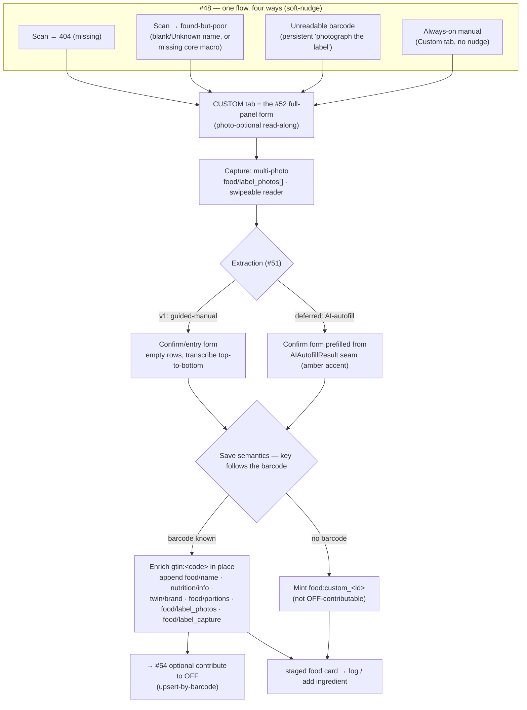

# Design — the end-to-end label-capture flow & where it lives (#53)

Resolves wayfinder ticket **#53** (parent map **#47**). Assembles the closed
tickets — the #48 trigger, the #51 extraction deferral, the #52 full-panel form —
into one flow, and settles the three decisions #53 owned: **capture**,
**placement**, and **save semantics** (entity identity + provenance).

This is a design asset, not an implementation. It is the input to **#55** (the ADR

- `ready-for-agent` impl tickets) and to **#54** (the OFF contribution step).

---

## The assembled flow



The flow is one path with four doors. Every trigger lands on the **same** surface
(the upgraded Custom tab), which is the same #52 form for both extraction modes,
which saves through one rule. The branching lives only at the two ends — how you
_arrived_ (#48) and where the twin is _keyed_ (barcode or not).

---

## Decision 1 — Placement: **upgrade the Custom tab in place**

The Custom tab in `FoodStager.svelte` _becomes_ the #52 "Read-along" full-panel
form. The four-macro grid it shows today is subsumed: the #52 form leads with the
**Macros** section and keeps a sticky Save bar, so a quick estimate is still "type
name + calories → Save," never scrolling past the micros (which stay **absent, not
0**). No new tab; the tab bar stays `🔍 Search · 📷 Scan · ✏️ Custom`.

- **Photo is optional.** Always-on manual entry (a homemade food, no label) uses
  the form with no photo; the identity-card thumbnail is simply absent. Only the
  three barcode/label-driven doors arrive with photos.
- **The four doors all resolve to this tab:**
  - **Missing (404):** `handleBarcodeLookup`'s `ProductNotFoundError` branch (today
    "Add it as a custom entry") → `switchMethod("custom")`, **carrying the barcode**
    so save keys `gtin:<code>` (see Decision 3a).
  - **Found-but-poor:** the #48 soft-nudge on the staged poor twin → the same Custom
    tab, **prefilled** with the partial OFF payload (name if any, whatever nutriments
    OFF had) and carrying `gtin:<code>` + the OFF `completeness`.
  - **Unreadable:** the "photograph the label" escape → Custom tab; the user types
    the barcode number if they can read it (→ `gtin:` path), else proceeds
    barcode-less (→ `food:custom_`).
  - **Always-on manual:** the Custom tab as it is reached today — no nudge.
- **Why in place, not a 4th "Label" tab:** one custom-entry mental model, not two;
  the fast path is preserved by the form's own layout; and the scan-404 "Add it"
  hand-off already targets Custom, so no re-routing.

**Carries into #55:** the `StagerSeed` custom case (`src/lib/food/food-staging.ts`)
must widen from `{name, calories, protein, fat, carbs, photo_base64}` to seed the
full panel + a barcode + partial-payload + `completeness`, so the four doors can
prefill the form. `commit({kind:"custom", …})` and `saveCustomFood`'s signature
widen correspondingly (see Data summary).

---

## Decision 2 — Capture: **multi-photo array, swipeable reader**

One food accepts N photos (the olive-oil label spanned two sides — nutrition on
one, barcode on the other).

- **Presentation:** the #52 identity-card thumbnail shows the **first** photo with a
  **"+N"** badge; tapping opens the full-screen reader as a **swipeable** gallery
  across all photos. An **"+ Add photo"** affordance appends another shot (same
  `<input type=file accept=image/* capture=environment>` idiom already in
  `FoodStager`). A photo can be removed before save.
- **No stitching in v1.** Guided-manual transcription means the human reads across
  the images; there is no pixel-stitch. (Stitching, if ever needed, is a concern of
  the future AI effort, not this flow.)
- **Storage:** an ordered array **`food/label_photos: string[]`** (base64), first =
  display. For display compatibility the flow **also** mirrors
  `food/label_photos[0]` into the existing singular **`food/photo_base64`**, so
  every current display surface (the staged card, consumption views, the recipe
  ingredient picker) shows the photo unchanged — the array is purely additive.
- **Absent** `food/label_photos` ⇒ a photo-less manual entry.
- **Downstream value:** the full set is what the future AI call (#49) sends to the
  model and what the OFF contribution (#54) uploads — so capturing all photos in v1
  is not speculative, even though v1 itself only reads them by eye.

---

## Decision 3a — Entity identity: **the key follows the barcode**

| Door                   | Barcode? | Entity             | Save action                                                              |
| ---------------------- | -------- | ------------------ | ------------------------------------------------------------------------ |
| Missing (404)          | known    | `gtin:<code>`      | **mint** the twin there                                                  |
| Found-but-poor         | known    | `gtin:<code>`      | **append** corrected datoms (latest-wins supersedes the poor OFF values) |
| Unreadable → typed     | known    | `gtin:<code>`      | mint/append as above                                                     |
| Unreadable → no number | none     | `food:custom_<id>` | mint                                                                     |
| Always-on manual       | none     | `food:custom_<id>` | mint                                                                     |

- **Why the barcode owns the key:** `handleBarcodeLookup` already does a
  **local-first** lookup — `getLocalFoodTwin("gtin:"+code)` _before_ calling OFF —
  so a twin saved at `gtin:<code>` is exactly what the next scan of that barcode
  returns. Keying there means a correction **surfaces on re-scan**; keying a
  separate `food:custom_` would orphan it and the poor OFF data would resurface.
- **Enrich-in-place is a plain append.** The ledger is append-only, latest-wins per
  attribute (`getLocalFoodTwin` folds HLC-ascending). Appending `food/name` +
  `nutrition/info` (+ brand, portions, photos, label-capture provenance) to an
  existing `gtin:` entity supersedes the poor OFF values on the next read — no
  delete, no migration.
- **`saveCustomFood` already has the seam:** its `customEntityId` parameter. Pass
  `gtin:<code>` to enrich; omit it to mint `food:custom_`. The flow decides which
  by whether a barcode reached the form.
- **Matches OFF's identity.** OFF products _are_ barcode-identified, and #50's write
  API is **upsert-by-barcode**. Keying at `gtin:<code>` means the twin #54
  contributes is the OFF-shaped, barcode-keyed entity — a clean 1:1 map. A
  barcode-less `food:custom_` twin has no barcode to upsert under and is therefore
  **not OFF-contributable** (correctly; #54 gates its contribution offer on a
  barcode being present).

---

## Decision 3b — Provenance: **a distinct `food/label_capture` attribute**

Enrich-in-place means a found-but-poor `gtin:` twin holds **both** OFF-sourced and
user-entered data in one entity. The origin of each must stay legible, and the
existing `twin/raw_provenance` (the OFF raw response, `adapter: "off"`) must not be
lost.

- **Do not overwrite `twin/raw_provenance`.** A second `twin/raw_provenance` datom
  would latest-wins-supersede the OFF blob on the folded read. Instead, label origin
  is recorded under a **new** attribute:

  ```jsonc
  "food/label_capture": {
    "adapter": "label",
    "adapter_version": 1,
    "method": "manual",          // "manual" (v1) | "ai-confirmed" (deferred #49/#51)
    "basis": "100 g",            // the #52 basis toggle → serving_size string
    "fields": ["name", "nutriments", "portions"]  // what the user supplied/edited
  }
  ```

  It follows the `RawProvenance` spirit (`src/lib/food/provenance.ts`: pure,
  deterministic, no clock — the Datom's `time` is the capture basis) but is a
  **sibling** attribute, so OFF's `twin/raw_provenance` survives beside it and the
  twin's dual origin is auditable. For a barcode-less `food:custom_` twin there is
  no OFF provenance — only `food/label_capture`.

- **Photos are referenced, not duplicated.** `food/label_capture` does **not** copy
  the base64; the photos live once in `food/label_photos[]`. (The future AI case may
  additionally keep the model's raw pre-edit suggestion here for audit — #49's
  "never write un-reviewed" — but that is the AI effort's extension, not v1.)
- **UI marker (resolves the "provenance of user-captured foods" fog):** the
  **presence** of `food/label_capture` drives a small badge on the twin —
  **"✏️ edited from label"** on a `gtin:` twin that also has OFF provenance,
  **"✏️ your entry"** on a `food:custom_` twin with no OFF provenance. The badge is
  advisory (it does not change logging); its exact placement on the staged card is a
  detail for #55.

---

## Data & schema summary (for #55)

New / changed attributes on a food twin:

| Attribute            | Shape               | Notes                                           |
| -------------------- | ------------------- | ----------------------------------------------- |
| `food/label_photos`  | `string[]` (base64) | ordered, first = display; additive              |
| `food/photo_base64`  | `string`            | mirror of `label_photos[0]` for display-compat  |
| `food/label_capture` | object (above)      | origin marker; sibling to `twin/raw_provenance` |
| `nutrition/info`     | `NutritionInfo`     | full panel from the #52 form (grams stored)     |
| `twin/brand`         | `string`            | OFF-parallel; from the form's Brand field       |
| `food/portions`      | `Portion[]`         | from the form's Portions section                |

`saveCustomFood` widens (illustrative — final shape is #55's to cut):

```ts
saveLabelFood({
  name, brand?, nutrition: NutritionInfo, portions?: Portion[],
  labelPhotos: string[], labelCapture: LabelCapture,
  entityId?: string,          // gtin:<code> to enrich | undefined to mint food:custom_
}): Promise<string>
```

Reuse — not reinvent:

- The **full panel** is built by the #52 form via the real
  `parseNutrientEntry`/`nutrientDisplayValue` round-trip (grams stored, mg/µg typed)
  and `NutritionInfo` (ADR-0021/-0030). **Absent ≠ 0** — untouched rows are omitted.
- **Basis** → `serving_size` string (`100 g` / `N g` / `1 serving`), as #52 specced.
- The **staged card** after save is the existing `FoodStager` staged view — the
  captured twin flows through `mapPayloadToFoodResult` and logs like any other food.

---

## Hand-offs

**To #54 (OFF contribution):**

- Contribution is offered **only** when the saved twin is keyed `gtin:<code>` (a
  barcode exists) — barcode-less `food:custom_` twins are not contributable.
- What #54 sends maps from the OFF-shaped `gtin:` twin: `food/name`, `twin/brand`,
  the `nutrition/info` nutriments, `food/portions`, and the `food/label_photos[]`
  images. #54 still owns consent/opt-in, auth (the user's own OFF login, #50), and
  new-product-add vs edit-to-found-but-poor.

**To #55 (ADR + impl tickets):** everything above is decided; #55 folds it into the
ADR and cuts sequenced `ready-for-agent` tickets. Likely seams to ticketise:

1. `StagerSeed` + `commit`/`FoodChoice` widening for the four-door prefill.
2. The Custom-tab-as-#52-form build (wire `_prototype-52/` Variant B to the store).
3. Multi-photo capture + swipeable reader + `food/label_photos[]` storage & display
   mirror.
4. `saveLabelFood` (enrich-`gtin:` vs mint-`food:custom_`) + `food/label_capture`
   provenance + the origin badge.

---

## Fog resolved by this ticket

- **Enrich-in-place vs new twin (entity identity)** → resolved: key follows the
  barcode (3a).
- **Provenance of user-captured foods** → resolved: distinct `food/label_capture`
  attribute + presence-driven UI badge (3b).

Both were **Not yet specified** items on the map; they graduate here and are removed
from the map's fog.
